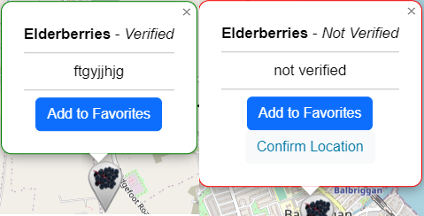

# Foragers Friend

Forager's Friend is an interactive web application designed for nature enthusiasts and foraging hobbyists. It provides a user-friendly platform to discover, add, and verify foraging locations, enriching the experience of outdoor explorers.

## Features

- **Interactive Map**: Locate and explore various forageable items, such as wild berries and herbs, on an intuitive map interface.

- **Add Locations**: Users can add new foraging locations, complete with notes and details.

- **Favorites**: Mark locations as favorites for easy access in future foraging adventures.

- **Community-Driven Verification**: Locations are verified through community confirmation, ensuring the reliability of the information.

- **User Participation**: Engage users in the verification process, allowing them to confirm the authenticity of unverified locations.

Users have to be logged in to be able to add locations, add favorites, confirm locations and delete their own locations. Checks have been implemented to prevent users from being able to delete other locations, and users are not able to confirm the same location multiple times.

## Design

### Fonts
Standard fonts are used throughout the site, plans to investigate better fonts.

### Icons
Icons have been created personally, using icons taken from [flaticon](https://www.flaticon.com/). These icons were then pasted directly onto one of Leaflet's default icons.

### Logo/Favicon
Designed using paint.net.

### Colour Scheme

No real modifications made to the default bootstrap theme, as I wanted a minimalistic approach to the display, so as to not draw focus from the map itself. Buttons are colour coded to draw attention. 

### User Suggestions:
* I would like to be able add favorite locations.
  * Using a many to many field in the main model, I implemented a basic favorites list.
* I would like to change or remove my locations.
  * Added delete and edit buttons that allow users to be able to change or remove.
* I would like to be able to add my current location.
  * Implemented a location request, as well as an 'Add Current Location' botton to home page.
* I want to be able to add more location types.
  * Not implemented, however contact form will submit a request to Admin panel.

## Technologies Used

- **Frontend**: HTML, CSS, JavaScript
- **Backend**: Django (Python)
- **Database**: ElephantSQL
- **Mapping Service**: Leaflet

### Libraries Used
- FontAwesome
- Bootstrap
- Cloudinary
- Django

## Testing
### Validation
* HTML tested with W3C HTML5 Validator every day.
* CSS has been validated with W3C CSS Validator every day or major change.
* Tested against PEP8 validation for compliance. Several errors around indentation found but these were minor and corrected easily.

### External Testing
* My code was sent to friends and family for feedback and testing.
* All user input is error checked to prevent improper input from the user.
* As the game was built using a Windows 11 PC, the majority of the testing was done using this machine and VS Code on gitpod, as well as on Heroku.

### Internal Testing / Bugs found
Code was mostly tested on VS Code and PythonTutor with regular PEP8 checks.

### Database
Database had to be reset several times:
* Database initially had name and description. When these were pulled, database would no longer accept migrations and needed to be reset.
* By mistake I accidentally deleted the site from the database and had to create a new one manually.

### Map
* Initially any user could add locations, prevented this by using a check to determine if the user was logged in or not. Users not logged in are redirected to the login page.

### Redirects
* The user was often redirected to the homepage with no warning on deleting favourites or account, with no prompt in the middle. The views had to be rebuilt from the ground up to rectify this and send the user on the correct path.

### JavaScript
* JavaScript is used to automatically send the selected latitude and longitude to the 'add_item' page but initially this simply kept throwing errors. By adding `window.location.href = '/add_item/?latitude=${lat}&longitude=${lon}'` to the script, I was able to pass it through the URL created.

### Automated Testing
* There was little need for automated testing although I did need some to send mock locations as I was unable to travel to test accuracy.

* I did add automated tests for deleting other user's locations using URL manipulation as I couldn't figure out the exact URL needed.

### Security Testing
* I also identified that users could:
    * Add locations when not signed in
    * Manipulate the URL to edit or delete other user's locations
    * Manually input latitude and longitude to add incorrect locations

* These were fixed by:
    * Disallowing users not signed in from adding locations
    * Checking if the user accessing the URL was the creator of the location
    * Using JavaScript to parse location behind the scenes and by preventing the user from changing the forms

## Database Schema

## Deployment
1. Navigate to [https://github.com/Karl-Ryan0/foragers-friend](https://github.com/Karl-Ryan0/foragers-friend).
2. You can set up your own repository and copy or clone it, or you fork the repository.
3. `git add`, `git commit` and `git push` to a GitHub repository, if necessary.
4. GitHub pages will update from the master branch by default.
5. Go to the **Settings** page of the repository.
6. Scroll down to the **Github Pages** section.
7. Select the Master Branch as the source and **Confirm** the selection.
8. Wait a minute or two and it should be live for viewing.

Live link can be found [here](https://foragers-friend-5b6ca9d8e935.herokuapp.com/).

## Credits
* Django backend
* Bootstrap
* Flaticon
* All code was freehand however additional thanks for the people at Mammoth Interactive and CI for the great tutorials.
* Images on this readme are my own screenshots.

